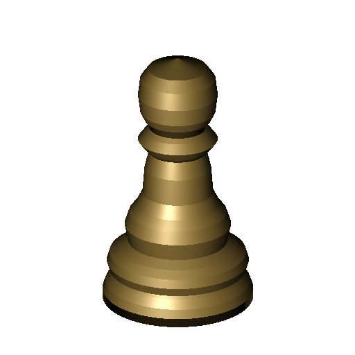
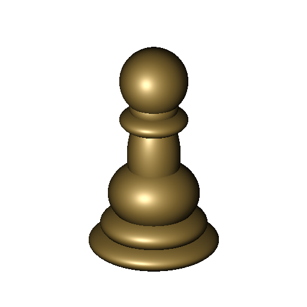
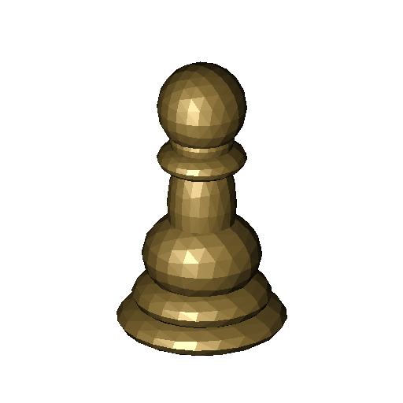
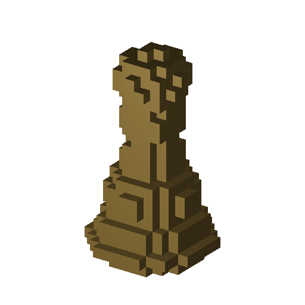
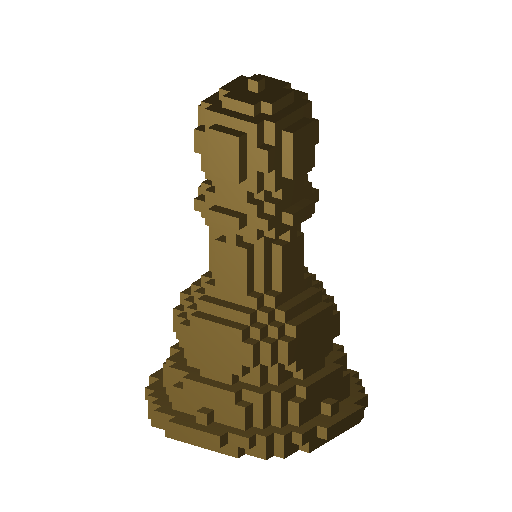
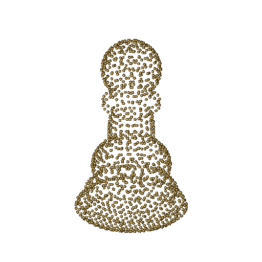
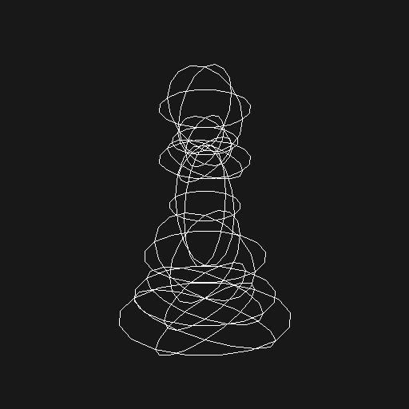

= Solid Geometry Representation Comparisons
:doctype: article
:toc:
:toclevels: 2

The same shape can be stored in very different ways.  This comparison uses a
purpose-built chess pawn to show which information BRL-CAD retains, evaluates,
or samples when moving among its principal geometry representations.  It is a
guide to semantics and conversion choices, not a claim that one representation
is universally best.

== Common model and method

The reference pawn is a region containing seven overlapping ellipsoids.  Their
union is non-trivial enough to exercise curved surfaces, overlapping interiors,
and several component boundaries while remaining reliable across the
conversions shown here.  The sketch-and-revolve version independently follows
the same nominal profile; it is not an exact conversion of the seven-piece CSG
model.

Every shaded image uses the same orthographic view, 512x512 image size,
material, and single-threaded renderer.  The wireframe uses the same view and
image size.  The faceting and sampling settings are intentionally coarse enough
to remain visible.  A similar silhouette therefore does not mean that two
database objects have the same structure or numerical boundary.

NOTE: This article and its images are a committed snapshot.  Developers can
regenerate the figures from built BRL-CAD tools by configuring with
`-DBRLCAD_GENERATE_SOLID_REPRESENTATION_COMPARISON=ON` and building the
`solid-representation-comparison-snapshot` target.

== At a glance

[cols="2,2,1,2,4",options="header"]
|===
|Form
|BRL-CAD storage
|Solid?
|Boolean state
|Editing and conversion consequences

|Analytic CSG
|Seven `ell` leaves in a combination
|Yes
|Retained
|Compact primitive parameters and tree edits preserve construction intent.

|B-rep tree
|Closed `brep` leaves in a combination
|Yes
|Retained
|NURBS surfaces and trims replace analytic leaves, but the assembly tree remains.

|Evaluated B-rep
|One closed `brep`
|Yes
|Evaluated
|Direct face, edge, trim, and control-point editing is possible; original
features and hierarchy are gone.

|Polygonal tree
|Solid-mode `bot` leaves in a combination
|Yes
|Retained
|Leaf tessellation is approximate, but components and their union tree remain
independently replaceable.

|Evaluated NMG
|One `nmg`
|Yes
|Evaluated
|Stores explicit, topology-rich polygonal boundaries and can record
non-manifold relationships.

|Evaluated triangle mesh
|One solid-mode `bot`
|Yes
|Evaluated
|Portable triangle connectivity, but curved geometry and construction history
have been sampled away.

|Sketch and revolve
|One `sketch` referenced by one `revolve`
|Yes
|Not needed here
|The profile, axis, and sweep angle are compact, meaningful parameters.

|Voxel cells
|A region containing many `arb8` boxes
|Yes (sampled)
|Cell union retained
|Individual cells are ordinary CSG geometry; size grows rapidly as cells
shrink.

|Sampled volume
|A file-backed `vol` scalar grid
|Yes (thresholded)
|None
|Compact regular-grid occupancy; resolution and threshold determine the boundary.

|Point cloud
|One `pnts` object with positions and normals
|No pawn interior
|None
|Useful as measured or sampled evidence, but it has no inherent connected
boundary or inside/outside rule.

|Wireframe
|Derived line display of the CSG object
|No
|Uses source tree
|A view-dependent drawing aid, not an independent solid representation.
|===

"Solid" in this table means that the stored object supplies usable
inside/outside semantics for the pawn.  An arbitrary B-rep or mesh is not
automatically a solid: its boundary must be closed and consistently oriented.
The point size used to render `pnts` makes each sample a small sphere, but those
spheres do not reconstruct the pawn interior.  A wireframe likewise does not
become a solid merely because its curves appear closed in one view.

== Implicit and parametric forms

[cols="1,1"]
[%noheader]
|===
|
|

|*Analytic CSG.* Native primitives retain their equations and dimensions; the
region evaluates their union during ray tracing.
|*Sketch plus revolve.* A closed line-segment profile is swept through 360
degrees.  The stepped profile is intentional and remains editable in two
dimensions.
|===

Analytic CSG is an implicit representation: intersections with ideal primitive
surfaces are computed as needed rather than read from a stored boundary mesh.
It is usually the most compact form here and makes edits such as changing the
head radius or stem proportions direct.  Its Boolean hierarchy also records why the
shape was assembled.

`sketch` plus `revolve` is another procedural, parameterized description.  It
works especially well for an axisymmetric part, although a sketch with only
line segments produces conical and cylindrical bands rather than the pawn's
original ellipsoidal surfaces.  BRL-CAD supports primitive parameters, placement
matrices, sketches, and sweeps; that should not be confused with a general
constraint solver or an associative feature-history system.

== Spline boundary representations

[cols="1,1"]
[%noheader]
|===
|image:images/solid_rep_brep_boolean.png[B-rep leaves with Boolean tree,512]
|

|*B-rep with Booleans.* Each analytic leaf becomes a closed B-rep whose
boundaries are trimmed NURBS surfaces.  The original union tree is retained.
|*B-rep without Booleans.* Boolean evaluation produces one explicit boundary;
operand identities and the construction tree no longer exist as editable
features.
|===

A B-rep stores faces, trims, edges, vertices, and their topology explicitly.
Rational NURBS can represent the source quadrics exactly as surfaces, but that
does not make every CSG-to-B-rep conversion exact: intersections, trimming,
topology classification, and repair use numerical tolerances.  Keeping a tree
of B-rep leaves isolates conversion to each primitive and retains high-level
editing.  Evaluating the tree yields a more self-contained boundary for
exchange and face-level work, at the cost of that history.  This snapshot's
evaluated result passes both `brep ... valid` and `brep ... solid`; conversion
results should be checked rather than assumed to be closed.

== Polygonal boundaries

[cols="1,1,1"]
[%noheader]
|===
|
|
|image:images/solid_rep_bot.png[Evaluated BoT pawn,512]

|*Polygonal with Booleans.* Each leaf is independently tessellated to a BoT,
then placed in the original union tree.
|*Evaluated NMG.* One non-manifold geometry object records the evaluated
polygonal boundary and its richer topology.
|*Evaluated triangle mesh.* One solid, counter-clockwise BoT stores 982
vertices and 1,960 triangular faces in this snapshot.
|===

All three images expose the same coarse tessellation.  Their similar appearance
hides an important distinction: the first still has seven editable operands,
whereas the NMG and single BoT are evaluated results.  NMG can represent
polygonal faces and non-manifold adjacency; BoT faces are triangles only.
Neither recreates analytic curvature when converted back.  Finer tessellation
reduces visible error but increases storage and processing cost.

== Sampled forms

[cols="1,1,1"]
[%noheader]
|===
|
|
|

|*Explicit voxel cells.* `voxelize` tests 3 mm cells and creates a CSG union of
699 boxes for cells exceeding the occupancy threshold.
|*Sampled volume.* `g-voxel` samples a 2 mm grid; a file-backed `vol` interprets
the resulting 17x17x30 byte array through an occupancy window.
|*Point cloud.* `pnts gen` samples the analytic surface on a 2 mm grid.  Small
rendered spheres make the otherwise zero-area sample locations visible.
|===

The two voxel images are deliberately separate.  The `voxelize` command emits
ordinary box primitives and a combination, while `vol` reads scalar samples on
a regular grid and derives a threshold boundary at ray-trace time.  Both are
volumetric approximations whose accuracy, memory, and feature size depend on
cell spacing.  A point cloud samples only the surface and has no connectivity;
surface reconstruction requires additional assumptions and may invent or omit
geometry.

== Wireframe display

This wireframe is a view-plane plot of MGED's unevaluated display of the
analytic CSG pawn; hidden lines are not removed.  Wireframes are useful for
selection, orientation, and seeing component curves, but they are ambiguous:
curves alone do not say which side is material, which loops bound faces, or
which surfaces enclose volume.  Keep the solid that generated the display
rather than treating the drawing as an equivalent conversion target.

== Conversion and editing consequences

A conversion command is not an equivalence guarantee.  Before replacing source
data, check at least these effects:

* *Tolerance and resolution:* B-rep Boolean evaluation uses intersection and
  topology tolerances; tessellation uses chord and angular tolerances; voxels
  and points use sample spacing and thresholds.  Each can erase a feature
  smaller than its controlling tolerance.
* *Construction intent:* evaluating a Boolean tree discards operand identity,
  primitive parameters, and ordering.  Converting leaves while retaining the
  tree keeps more of that intent.
* *Topology:* a visually plausible B-rep or mesh may contain gaps, duplicate
  faces, self-intersections, or inconsistent orientation.  Validate closure
  and ray behavior, not only a shaded image.
* *Attributes:* collapsing a hierarchy may change where region identifiers,
  materials, colors, and other attributes reside.  Verify them separately
  from geometry.
* *Round trips:* CSG to mesh to B-rep does not recover the original equations;
  points to a surface requires reconstruction; resampling a volume compounds
  discretization.  Retain the highest-level trustworthy source.

For parameter changes and repeated design work, prefer analytic primitives,
sketch sweeps, and preserved combination trees.  Prefer a validated B-rep when
trimmed-surface topology or exchange requires it.  Use NMG for topology-rich
polygonal processing and BoT for triangle-oriented interchange or algorithms.
Use voxels for occupancy operations and point clouds for measured or sampled
data, not as silent substitutes for a watertight solid.

BRL-CAD also supports specialized forms such as DSP height fields, EBM
extrusions, ARS surfaces, metaballs, and legacy `poly` and `bspline` objects.
They are not shown as interchangeable pawn encodings: DSP and EBM are
domain-specific, metaballs change the modeling method, and BoT and B-rep are the
preferred general successors to the legacy polygon and spline forms.

== Reproducing the conversions

The snapshot generator creates the database and runs these principal MGED
operations (names shortened here only where noted):

[source]
----
brep comparison.csg.r brep --no-evaluation
brep comparison.csg.r brep comparison.brep_evaluated.s
facetize -n comparison.csg.r comparison.nmg.s
facetize --methods NMG comparison.csg.r comparison.bot.s
facetize --methods NMG base.s base.bot        # repeated for all seven leaves
voxelize -s "3 3 3" -d 4 -t 0.45 comparison.voxel_cells.r comparison.csg.r
pnts gen -t 2 --surface --grid comparison.csg.r comparison.samples
pnts write comparison.samples comparison.xyz
pnts read -f xyzijk --size 0.45 comparison.xyz comparison.point_cloud.s
----

The generator also runs `g-voxel` and expands its sparse occupied-cell report
into the x-fastest byte array used by `vol`.  It then renders every shaded
object with `rt -B -M -P1` and the saved view; MGED's `plot -2d`, `plot3-fb`,
and `fb-png` produce the wireframe image.  See
`solid_geometry_comparison/generate_comparison.cmake` and
`solid_geometry_comparison/create_pawn.tcl` for the complete reproducible
inputs.
